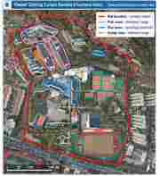
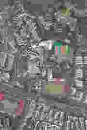

# SketchUp Campus Recreation Benchmark

这个仓库用于测试 Agent 是否能够根据一个真实但结构混乱的 SketchUp 校园模型和航拍参考图，**从零复刻一个新的、干净、结构化的 SketchUp 模型**。

> **本 benchmark 禁止“修复”原模型。只能复刻。**

此前的 repair 任务定义已经废弃。历史 repair submission 仅作为历史记录，不代表当前 benchmark 的有效提交。

## 输入与参考

### 1. 旧 SketchUp 模型（只读参考）

`input/6.8.6-颜色微调-1.skp`

这个文件只能用于观察：

- 建筑形状与体量；
- 建筑、平台、连桥、山体之间的三维空间关系；
- 高度、坡度、相对位置与朝向；
- 材质、颜色和可见外观；
- 复杂区域在不同视角下的关系。

**禁止直接编辑、清理、拆分、修补、另存为或在这个文件基础上继续建模。**

Agent 必须创建一个**全新的空白 SketchUp 文件**，然后根据参考信息独立复刻。

### 2. 航拍参考图



第一张图用于理解校园范围和主要功能区：

- 红线：校园范围；
- 粉色：宿舍区域；
- 蓝色：教学 / 教室区域；
- 橙色：食堂区域。



第二张图为原始航拍俯视参考，用于核对：

- 建筑平面轮廓；
- 道路、广场和运动场位置；
- 建筑之间的相对距离；
- 校园整体布局；
- 地形与周边环境关系。

参考图位于：

`references/`

## 核心任务

从一个新的空白 SketchUp 文件开始，复刻校园。

最终模型应该在视觉和空间上尽可能接近参考，同时内部结构必须比旧模型更合理、更适合继续编辑。

### 必须复刻

重点包括：

- 校园范围内主要建筑；
- 建筑的大致形状、体量、高度与朝向；
- 楼与楼之间的空间关系；
- 连桥；
- 建筑之间的平台；
- 主要道路与广场；
- 重要山体 / 地形高差；
- 体育场及主要运动区域；
- 能明显影响校园空间关系的其他结构。

不要因为某些连接关系复杂就省略平台、桥梁或地形。

## 建模要求

### 1. 必须从零创建

必须：

1. 打开一个新的空白 SketchUp 文件；
2. 将旧 SKP 和航拍图仅作为参考；
3. 在新文件中重新建模；
4. 最终保存新的 SKP。

以下行为均不允许：

- 打开原 SKP 后直接修改；
- 删除原模型中的错误几何后继续使用；
- 将原模型整体复制到新文件后再整理；
- 将原模型中的建筑直接复制 / 粘贴到新文件；
- 通过插件自动“清理”旧模型并作为结果；
- 对旧模型 Save As 后作为提交。

### 2. 模型必须结构化

不同语义对象应尽可能成为独立 Group / Component，例如：

```text
Campus
├── Terrain
├── Roads
├── Platforms
├── Bridges
├── Buildings
│   ├── Building_01
│   ├── Building_02
│   └── ...
├── Sports
└── Other
```

要求：

- 不同建筑不要共享裸几何；
- 建筑、桥、平台、地形尽可能独立；
- 对象应能单独选择和编辑；
- 避免无意义的碎片化 Group；
- 不要为了层级漂亮而破坏真实连接关系。

### 3. 优先保证整体空间关系

复刻时尤其注意：

- 连桥两端必须落在正确建筑 / 平台；
- 平台的高度和坡度关系要合理；
- 建筑不能悬空或明显插入错误地形；
- 山体和建筑的相对高差要保留；
- 体育场、主干道和主要建筑群的相对位置要正确。

## 参考信息冲突时的优先级

如果不同参考之间存在轻微冲突：

1. **三维空间关系、建筑高度、平台与连桥关系：优先参考原 SKP；**
2. **平面轮廓、校园整体布局、道路与建筑位置：使用航拍图交叉核对；**
3. **彩色分区图只用于识别校园范围和功能区，不作为精确尺寸依据。**

不要机械复制旧模型内部错误的面、边、Group 结构。旧模型提供的是**几何与空间参考**，不是需要保留的内部拓扑。

## 禁止事项

- **禁止修复原模型。**
- 禁止把旧 SKP 作为提交结果。
- 禁止从旧模型复制整栋建筑、平台、桥或地形作为新模型主体。
- 禁止只做部分校园后宣称完成。
- 禁止为了简化任务而删除复杂连桥、平台或高差。
- 禁止仅提交截图、报告、OBJ、FBX、STL 或脚本。
- 禁止直接向 `main` 提交 benchmark result。

## 交付方式

必须通过 Pull Request 提交。

最终文件必须位于：

```text
submissions/<agent-name>/campus_recreated.skp
```

PR 标题：

```text
[Submission] <agent-name> - campus recreation
```

PR 中说明：

- 使用的 Agent / 模型；
- 使用的 SketchUp 版本；
- 复刻了哪些内容；
- 哪些区域仍存在已知偏差；
- 明确确认：**最终 SKP 是从新的空白文件开始创建，而不是对输入 SKP 的修复或另存。**

## 通过标准

一个有效提交至少应满足：

- `campus_recreated.skp` 能正常打开；
- 确实从新的空白 SketchUp 文件开始创建；
- 主要校园建筑和空间关系完整；
- 连桥、平台、建筑、道路和地形关系没有明显错误；
- 整体布局与航拍图高度一致；
- 主要三维关系与参考 SKP 一致；
- 模型内部对象结构清晰并可继续编辑；
- 没有直接复用旧模型的混乱几何作为主体。

当前 benchmark 的核心评价原则是：

> **Do not repair the old model. Recreate the campus from scratch.**
